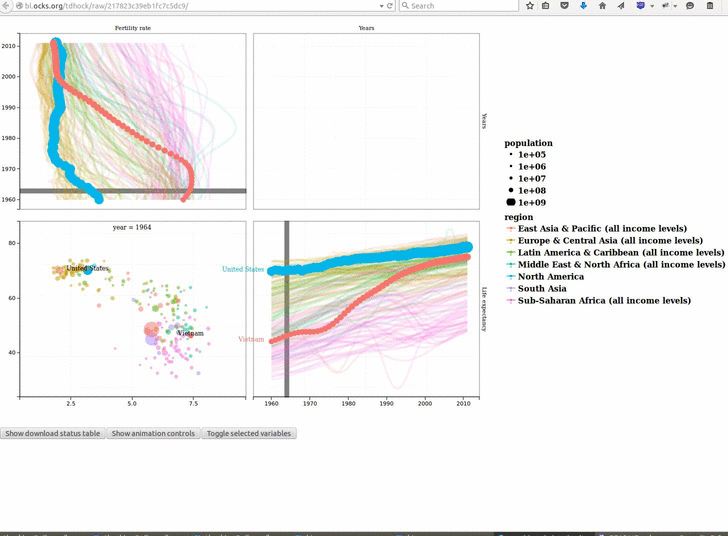

animint - an R package for *anim*ated *int*eractive web graphics
=======

[](https://travis-ci.org/tdhock/animint)
[](https://coveralls.io/r/tdhock/animint?branch=master)
[](https://app.wercker.com/project/bykey/3e56e443fb24a5ce304b706425ba6987)

Animint makes it possible to design multi-layer, multi-plot,
interactive, and possibly animated data visualizations using just a
few lines of R code. Animint adds clickSelects and showSelected
aesthetics to [ggplot2](https://github.com/hadley/ggplot2), and
renders using [D3](http://d3js.org/). For example, this multi-layer
facetted interactive animation of WorldBank data was defined using
only [about 60 lines of R code](inst/examples/WorldBank-facets.R).

[](http://bl.ocks.org/tdhock/raw/217823c39eb1fc7c5dc9/)

## Installation

```s
if (!require(devtools)) install.packages("devtools")
devtools::install_github(c("tdhock/ggplot2", "tdhock/animint"), build_vignettes=FALSE)
library(animint)
example(animint)
```

NOTE: [tdhock/ggplot2](https://github.com/tdhock/ggplot2) is required
since [hadley/ggplot2](https://github.com/hadley/ggplot2) introduced
some backwards-incompatible changes in Aug 2015. We would be more than
willing to accept code contributions via a Pull Request that gets
Animint working with the most recent version of ggplot2.

## Learning animint through examples

The best way to learn animint is through examples. A couple of good
introductions are Carson Sievert's [Interactive animations of
PITCHf/x](http://cpsievert.github.io/baseballR/20140818/) and Susan
VanderPlas' [animint tutorial](http://tdhock.github.io/animint/). In
addition, there is an [examples web
site](http://sugiyama-www.cs.titech.ac.jp/~toby/animint/index.html),
[examples distributed with
animint](https://github.com/tdhock/animint/tree/master/inst/examples), as
well as more complex 'big data' examples in the
[tdhock/animint-examples
repo](https://github.com/tdhock/animint-examples/tree/master/examples).

## Frequently asked questions (FAQ)

- Is there a list of new features in Animint, with respect to standard
  ggplot2?
  [Yes](https://github.com/tdhock/animint/wiki/Advanced-features-present-animint-but-not-in-ggplot2).

- Can I do brushing in Animint? If by "brushing" you mean "multiple
  selection," then yes the designer can use the
  [selector.types](https://github.com/tdhock/animint/wiki/Advanced-features-present-animint-but-not-in-ggplot2#multiple-selection)
  option to declare a multiple selection variable, which means that
  users will be able to click plot elements to add/remove items from
  the multiple selection set. For example see the [WorldBank-facets
  viz](http://bl.ocks.org/tdhock/raw/217823c39eb1fc7c5dc9/) and
  [source code](inst/examples/WorldBank-facets.R).
 
- Can I use animint inside of a Shiny app?
  [Yes](https://cpsievert.shinyapps.io/animintShiny/).

- Can I use animint inside of knitr?  [Yes, but use `structure(viz,
  class="animint")` rather than
  `animint2dir(viz)`](http://cpsievert.github.io/animint/worldPop/worldPop.html)

- Can I use animint inside of an interactive Rmarkdown document?
  [Yes](https://cpsievert.shinyapps.io/animintRmarkdown/)
  ([source](https://github.com/tdhock/animint/tree/master/inst/examples/rmarkdown)).


## Contribute to animint!

#### Write tests to increase code coverage

The easiest way to contribute to animint is by writing a new test that would increase the code coverage. First [check the coveralls status page and find a part of the code which is not tested](https://coveralls.io/github/tdhock/animint). Then fork animint and commit [a new test](https://github.com/tdhock/animint/tree/master/tests/testthat) that increases the coverage, and send us a Pull Request. It may be useful to read about [our testing framework](https://github.com/tdhock/animint/wiki/Testing).

#### Learn about the design and theory of animint

Before adding features to animint, you should first read about its design. There are two main components, which have separate wiki pages that explain their details:
- The [compiler](https://github.com/tdhock/animint/wiki/Compiler%20details) is written in R code.
- The [renderer](https://github.com/tdhock/animint/wiki/Renderer-details) is written in JavaScript code.

It would also be useful to read some theory in the
[academic paper describing
Animint](https://github.com/tdhock/animint-paper/blob/master/HOCKING-animint.pdf?raw=true). It explains: 

- the purpose of animint: make it easy to design data visualizations
which can be both animated and interactive.

- the clickSelects and showSelected keywords which permit
interactive linked plots.

- the advantages and disadvantages of animint compared to other
interactive data viz libraries.

It may also be useful to read our [short](https://github.com/tdhock/interactive-tutorial/tree/master/animation) and [long](https://github.com/tdhock/animint/blob/master/etc/references.org) tables of related work.

#### TODO list of features to implement

We keep a TODO list at top of the [NEWS](https://github.com/tdhock/animint/blob/master/NEWS) file. Feel free to implement one and send us a PR. They are categorized as follows:

- BUG: things which used to work but have stopped working. Tests should be added to prevent these. For example at one point in 2013, animint rendered the correct number of legend entries for the WorldBank viz, but in the beginning of 2014 animint rendered too many legend entries. 
- GGPLOT: things which ggplot2 supports but animint does not yet support. For example facets, coord_equal.
- DSL: changes to the animint domain-specific language (DSL) which would allow interactive/animated features. These involve changes to how we define the ggplots, and how the compiler works. For example custom alpha/color/etc for selected geoms, using selected.alpha/selected.color/etc aesthetics.
- EXAMPLE: examples to show off animint features, which should affect neither the compiler nor renderer. 
- RENDER: changes to the JavaScript rendering code which would result in better interactive plots, without having to change the definition of the ggplots. For example rendering a selection widget for every selection variable.
- OUTPUT: different output formats for viewing/sharing an interactive animation.
- OPTIMIZATION: things which are currently supported, but with an implementation that could be improved in terms of render/compile speed, disk usage, memory, etc. Typically these optimizations are not really noticed for small data sets, but make it easier to visualize large data sets. For example, can we gzip the TSV plot data files to reduce disk space and download times?
